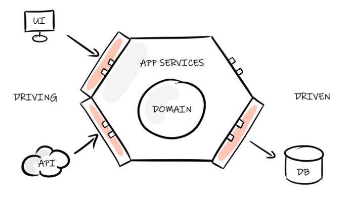

# **Bank Account Management - Hexagonal Architecture**

## **Présentation du Projet**

Ce projet est exercice qui répond au kata Bank Account de chez Exalt, l'objectif est de fournir une API REST sous le format d'une architecture hexagonale 

### **Fonctionnalités attendues:**

1. Dépot d'argent
2. Retrait d'argent
3. Consulter le solde actuel
4. Consulter les transactions précédentes

---

## **Architecture Hexagonale**



### **1. Domaine**

- **`domain/model`** :
    - Contient les entités métier, telles que :
        - **`Account`** : Représente un compte bancaire avec les informations essentielles (solde, utilisateur, etc.).
        - **`Transaction`** : Représente une opération bancaire (dépôt, retrait).
        - **`TransactionTypeEnum`** : Enumération pour définir les types d'opérations (`DEPOSIT`, `WITHDRAW`).

- **`domain/service`** :
    - Contient la logique métier dans la classe **`BankOperationsService`**, qui gère les opérations liées aux comptes bancaires :
        - Dépôt d'argent.
        - Retrait d'argent.
        - Consultation du solde et des transactions.

---

### **2. Ports**
Les ports définissent les **interfaces** qui permettent au domaine de communiquer avec les systèmes externes.

- **`application.ports.input`** :
    - Définit les **ports d'entrée** exposant les cas d'utilisation de l'application :
        - **`BankOperationsPort`** : Interface définissant les opérations que le domaine expose (par exemple : `deposit`, `withdraw`, `checkBalance`).

- **`application.ports.output`** :
    - Définit les **ports de sortie** utilisés pour interagir avec des systèmes externes, tels que les bases de données :
        - **`BankAccountRepository`** : Interface pour accéder aux données des comptes bancaires.
        - **`TransactionRepository`** : Interface pour accéder aux données des transactions.

---

### **3. Adaptateurs**
Dans le cadre de la conception de ce projet, j'ai fait le choix de regrouper tous les ports (à la fois les ports d'entrée et de sortie) dans un package unique appelé application.ports afin de rester proche du modèle 'Ports and Adapters architecture'.

- **Adaptateurs d'entrée** :
    - **`adapter.input.TransactionController`** :
        - Contrôleur REST exposant les endpoints pour les opérations bancaires. Exemple :
            - `POST /user/transaction` : Effectue un dépôt ou un retrait.
        - Traduit les requêtes HTTP en appels à `BankOperationsPort`.

- **Adaptateurs de sortie** :
    - **`adapter.output.BankAccountAdapter`** :
        - Implémente le port `BankAccountRepository` pour interagir avec la base de données via JPA.
    - **`adapter.output.TransactionAdapter`** :
        - Implémente le port `TransactionRepository` pour gérer les transactions dans la base de données.

---

### **4. Organisation du Code**
Pour respecter l'architecture hexagonale je me suis inspiré du modèle 'Ports and Adapters architecturei', j'ai volontairement inclus les inputs et outputs dans un package ports.

Je suis conscient qu’une autre approche consiste à regrouper chaque port avec son adaptateur ou service métier. 

Par exemple : les ports liés à la base de données (comme BankAccountRepository ou TransactionRepository) pourraient être placés directement dans un package avec leurs adaptateurs correspondants (BankAccountAdapter, TransactionAdapter).
````plain
src/
├── main/
│   ├── java/com/exalt/bank_account
│   │   ├── adapter/
│   │   │   ├── input/               # Adaptateurs d'entrée (ex : contrôleur REST)
│   │   │   ├── output/              # Adaptateurs de sortie (ex : JPA Adapter)
│   │   │   ├── request/             # DTOs pour les requêtes
│   │   ├── application/
│   │   │   ├── ports/
│   │   │   │   ├── input/           # Ports d'entrée
│   │   │   │   ├── output/          # Ports de sortie
│   │   ├── domain/
│   │   │   ├── model/               # Entités métier
│   │   │   ├── service/             # Logique métier
│   │   ├── infra/                   # Couche infrastructure (entités JPA)
│   │   ├── BankAccountApplication   # Point d'entrée de l'application Spring Boot
├── test/                            # Tests unitaires et d'intégration
````
### **5. Comment Exécuter le Projet**
1. Configuration de la base de données
   - Une base PostgreSQL est utilisée.
   - Le script db-init.sql initialise les tables et ajoute des données de test.
   - Assurez-vous que Docker est installé et exécutez 
````bash
   docker-compose up -d 
````
2. Lancer l'application
   - Utilisez un IDE ou la commande maven pour lancer le projet
````bash
  ./mvnw spring-boot:run
````